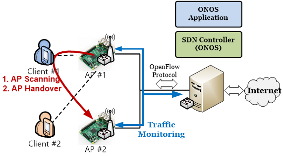

#Software-defined mobile traffic offloading controller
사용자는 이용 가능한 AP (Access Point)중 신호세기를 보고 모바일 단말과 연결할 AP를 선택할 수 있습니다. 하지만 연결된 AP에 과도한 트래픽이 흐르고 있다면 사용자는 만족할 만한 무선 통신 서비스를 받을 수 없게 됩니다. 따라서 AP의 트래픽을 모니터링 하여 모바일 단말의 연결의 관리해주는 프로그램이 필요합니다.
본 프로그램은 이에 대한 필요성에 의해 SDN (Software Defined Networking) 컨트롤러인 ONOS를 사용하여 AP의 트래픽을 모니터링 하고 모바일 단말과 AP의 연결을 관리해주기 ONOS Application과 Android Application으로 개발 되었습니다.



<figcaption>Fig1. System architecture</figcaption>

##1. ONOS 트래픽 오프로딩 어플리케이션
특정 AP에 과도한 트래픽이 발생하는 경우 해당 AP에 연결된 모바일 단말들은 다양한 서비스를 이용함에 있어 충분한 대역폭을 제공받지 못하게 됩니다. ONOS SDN 컨트롤러는 ONOS 트래픽 오프로딩 어플리케이션을 통해 지속적으로 트래픽을 모니터링 하면서 지정된 트래픽 임계값을 초과하는 AP가 발생하는 경우 해당 AP에 연결된 단말들의 트래픽과 신호세기를 고려하여 이동할 단말과 이동될 AP를 결정합니다. 

ONOS SDN 컨트롤러 관리자는 ONOS 트래픽 오프로딩 어플리케이션에 구현된 set과 get 명령어를 통하여 트래픽 임계값을 확인 및 설정 할 수 있다. 뿐만 아니라 client, scan, connect 등과 같은 명령어를 통해 컨트롤러에 접속된 모바일 단말을 직접 관리할 수 있습니다. 

0. <strong>offloading client</strong>
<br />현재 ONOS SDN 컨트롤러에 접속된 모바일 단말 리스트를 출력

0. <strong>offloading scan [client bssid]</strong>
<br />모바일 단말[client bssid]에게 주위 AP 신호 세기 SCAN 명령을 전송 후 모바일 단말로부터 받은 SCAN 결과를 출력 및 저장

0. <strong>offloading output [client bssid]</strong>
<br />ONOS SDN 컨트롤러에 저장되어 있는 모바일 단말[client bssid]의 저장 주위 AP 신호 세기 정보를 출력

0. <strong>offloading connect [client bssid] [ap bssid] [ap passward]</strong>
<br />모바일 단말[client bssid]을 Target AP[ap bssid]에 연결

0. <strong>offloading set [capacity]</strong>
<br />AP에 허용되는 트래픽 임계값을 설정

0. <strong>offloading get </strong>
<br />AP에 설정된 트래픽 임계값을 확인
 
0. <strong>offloading add_ap [ap_ovs_port_mac] [ap_ssid ] [ap_bssid]</strong>
<br />ONOS controller에 관리될 ap 정보 등록 

##2. ONOS 트래픽 오프로딩 어플리케이션 설치 및 설정
ONOS에 트래픽 오프로딩 기능을 추가하기 위해 본 연구를 통해 개발된 ONOS 트래픽 오프로딩 어플리케이션을 설치해야 합니다. 프로그램은 GitHub을 통해 공개하고 있으며 다음과 같 설치 할 수 있습니다.

0. ONOS 설치 및 실행
 <br />본 프로그램은 SDN 컨트롤러 중 하나인 ONOS를 사용하였습니다. 설치 파일은 https://wiki.onosproject.org/display/ONOS/Download+packages+and+tutorial+VMs 에서 제공하고 있으며, https://wiki.onosproject.org/display/ONOS/Installing+and+Running+ONOS 에서 설치 및 실행 방법을 설명하고 있습니다.

0. Traffic offloading 다운로드 및 컴파일
  ```
  # sudo git clone https://github.com/MobileConvergenceLab/TrafficOffloadingONOS
  # mvn clean install
  ```

0. ONOS 트래픽 오프로딩 어플리케이션을 설치
  ```
  # onos-app localhost install target/trafficMon-1.0-SNAPSHOT.oar
  ```

0. ONOS CLI에서 설치된 어플리케이션을 활성화 
  ```
  # onos> app activate kr.ac.postech.app
  ```

0. ONOS 트래픽 오프로딩 어플리케이션에서 관리해야 되는 AP 등록 
  ```
  # onos> offloading add_ap [ap_ovs_port_mac] [ap_ssid] [ap_bssid]
  ```

##3. Access Point
본 시스템에서는 Hostapd, OVS를 설치하여  라즈베리 파이 2를 AP로 만들었습니다.

0. Hostapd와 ISC DHCP server를 설치 
  ```
  # apt-get update
  # apt-get install iw hostapd isc-dhcp-server
  ```

0. /etc/hostapd/interfaces 설정
  ```
  File : /etc/hostapd/interfaces

  allow-hotplug wlan0
  auto wlan0
  iface wlan0 inet static
  address [wlan0 IP]
  netmask [wlan0 netmask]
  gateway [wlan0 gateway]

  auto eth0
  iface eth0 inet static
  address [eth0 netmask]
  gateway [eth0 gateway]
  netmask [eth0 netmask]


  File : /etc/hostapd/hostapd.conf

  interface=wlan0
  driver=nl80211
  ssid=[SSID]
  hw_mode=g
  channel=6
  ```

0. /etc/dhcp/dhcpd.conf 설정
  ```
  File : /etc/dhcp/dhcpd.conf

  subnet [DHCP subnet] netmask [DHCP netmask] {
  range [DHCP 할당 시작 IP address] [DHCP 할당 마지막 IP address];
  option domain-name-server [DNS IP address] 
  }
  ```

0. /etc/default/isc-dhcp-server 설정
  ```
  File : /etc/default/isc-dhcp-server 

  INTERFACES="wlan0"
  ```

0. DHCP 설정 후 재시작한다.
  ```
  # sudo service isc-dhcp-server restart
  ```

0. /etc/sysctl.conf 설정 
  ```
    File : /etc/sysctl.conf
  ```

0. iptable 설정 
  ```
    # sudo iptables -P FORWARD ACCEPT
    # sudo iptables --table nat -A POSTROUTING -o eth0 -j MASQUERADE
  ```

0. OVS 설치  
네트워크 에뮬레이터인 Mininet을 설치하여 OVS를 쉽게 설치 할 수 있습니다. Git을 이용하여 Mininet을 다운로드 및 설치합니다.
  ```
  # git clone git://github.com/mininet/mininet
  # cd mininet/util
  # install.sh –a
  ```

0. OVS Bridge 구성
  ```
  # ovs-vsctl add-br br0
  # sudo ifconfig br0 up
  # ovs-vsctl set-controller br0 tcp:[ONOS Controller IP]:[ONOS Controller Port]
  ```


